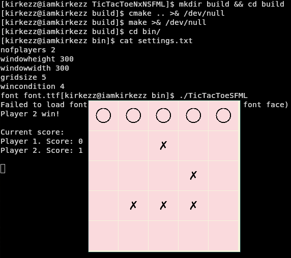

# TicTacToeNxN

A simple implementation of the [Tic-Tac-Toe](https://en.wikipedia.org/wiki/Tic-tac-toe) game I wrote one day.
You can also check out a recursive implementation of Tic-Tac-Toe based on this code: https://github.com/kirkezz/rttt



## build

The following should work:

```
cmake -S . -B build
cmake --build build --config Release
cd build/bin/
```

## usage

The game supports a simple configuration file (settings.txt).
